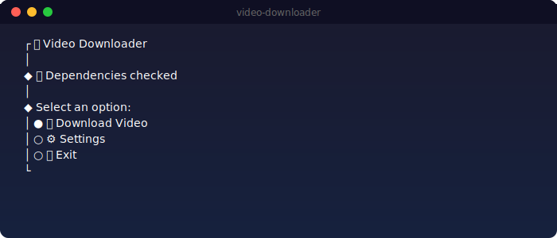
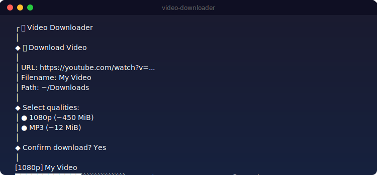
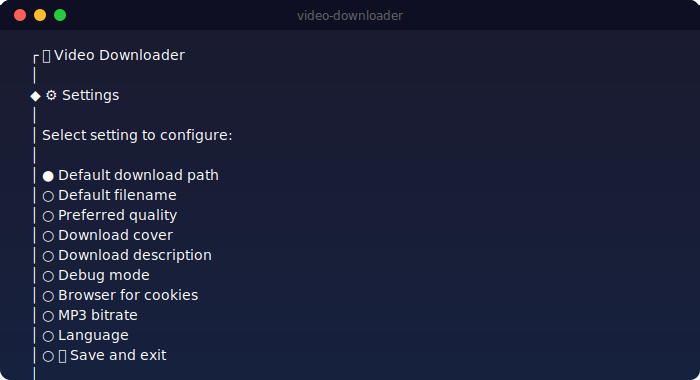

# Video Downloader

🎮 Universal video downloader for YouTube, VK and other platforms with support for multiple formats and automatic dependency installation.

## Features

### 🌍 Internationalization (i18n)
- **Multi-language support**: English and Russian
- **Auto-detection**: Automatically detects system language on first launch
- **Manual selection**: Users can manually select language on first run
- **Language switching**: Language can be changed in settings at any time
- Translation files stored in `/i18n` folder

### 📹 Video Download
- **Multiple platforms**: YouTube, VK, and other supported platforms
- **Multiple qualities**: 4K, 1080p, 720p, 480p
- **Audio extraction**: MP3 with custom bitrate
- **File size preview**: Shows estimated file size before download
- **Batch download**: Download multiple qualities simultaneously

### 🎵 Audio Features
- **MP3 extraction**: Convert video to audio only
- **Custom bitrates**: 64, 96, 128, 192, 256, 320 Kbps
- **Metadata**: Automatic ID3 tags (title, artist, date, description)
- **Cover art**: Embedded album artwork
- **Multiple formats**: Best available audio quality

### ⚙️ Settings
- **Default download path**: Customizable save location
- **Default filename**: Template-based naming
- **Preferred quality**: Auto-select default quality
- **Browser cookies**: Support for Chrome, Firefox, Safari, Edge, Brave, Opera
- **Debug mode**: Detailed error logging
- **Cover download**: Optional thumbnail download (JPG)
- **Description download**: Optional video description
- **MP3 bitrate**: Customizable audio quality

### 🔧 Automatic Dependency Management
The application automatically installs required dependencies:

#### yt-dlp
- Downloads latest version from GitHub releases
- Supports macOS (Apple Silicon & Intel), Linux, Windows
- Stored in `~/.video-downloader/bin/`

#### ffmpeg
- Downloads static builds for your platform
- Supports all major formats and codecs
- Required for audio extraction and format conversion

### 📊 Download Progress
- **Progress bar**: Visual representation with percentage
- **Real-time stats**: Downloaded/total size and speed
- **Format info**: Shows quality and filename
- **Completion summary**: Total files and size downloaded

### 🎨 User Interface
- **Interactive CLI**: Beautiful prompts via @clack/prompts
- **Clear menus**: Intuitive navigation
- **Error handling**: User-friendly error messages
- **Emoji support**: Visual indicators for actions

## Screenshots

### Main Menu


### Download Process


### Settings Menu


## Installation

### Option 1: Binary (Recommended)
Download pre-built binary for your platform:

```bash
# macOS (Apple Silicon)
./video-downloader-macos-arm

# macOS (Intel)
./video-downloader-macos

# Linux
./video-downloader-linux

# Windows
video-downloader-windows.exe
```

### Option 2: Build from Source

Requirements:
- [Bun](https://bun.sh/) installed

```bash
# Clone repository
git clone <repository-url>
cd video-downloader

# Install dependencies
bun install

# Run in development mode
bun run dev

# Build for all platforms
bun run build:all

# Build for specific platform
bun run build:macos      # macOS Intel
bun run build:macos-arm  # macOS Apple Silicon
bun run build:linux      # Linux
bun run build:windows    # Windows
```

## Usage

### First Launch
1. The app will auto-detect your system language (English/Russian)
2. If system language is not detected, you'll be asked to select one
3. The app automatically downloads yt-dlp and ffmpeg if not present

### Download Video
1. Select "📺 Download Video" from main menu
2. Enter video URL (YouTube, VK, etc.)
3. Enter filename (defaults to video title)
4. Select download path (defaults to current directory)
5. Select qualities to download (shows file sizes)
6. Confirm download
7. Wait for download to complete

### Settings
Access via "⚙️ Settings" menu:
- Default download folder
- Default filename template
- Preferred quality
- Download cover (Yes/No)
- Download description (Yes/No)
- Debug mode (Yes/No)
- Browser for cookies
- MP3 bitrate
- Language selection

### Supported Formats

**Video:**
- MP4 (various qualities)
- 4K, 1080p, 720p, 480p

**Audio:**
- MP3 with custom bitrate
- Automatic metadata tags
- Embedded cover art

## Configuration

Settings are stored in:
- **macOS/Linux**: `~/.video-downloader-settings.yaml`
- **Windows**: `%USERPROFILE%\.video-downloader-settings.yaml`

Dependencies are stored in:
- **macOS/Linux**: `~/.video-downloader/bin/`
- **Windows**: `%USERPROFILE%\.video-downloader\bin\`

## Project Structure

```
video-downloader/
├── src/
│   ├── index.ts              # Main application entry
│   ├── dependencies.ts       # Dependency management
│   └── i18n/
│       ├── index.ts          # i18n module
│       ├── en.json           # English translations
│       └── ru.json           # Russian translations
├── dist/                      # Compiled binaries
├── package.json              # Project configuration
└── README.md                 # This file
```

## Technical Details

### Built With
- [Bun](https://bun.sh/) - JavaScript runtime
- [@clack/prompts](https://github.com/bombshell-dev/clack) - Interactive CLI
- [yt-dlp](https://github.com/yt-dlp/yt-dlp) - Video downloader
- [ffmpeg](https://ffmpeg.org/) - Media processing
- [yaml](https://github.com/eemeli/yaml) - YAML parser

### Supported Platforms
- macOS (Apple Silicon & Intel)
- Linux (x64)
- Windows (x64)

### Binary Compilation
The application is compiled to native binaries using Bun's `--compile` flag, allowing it to run without Node.js or Bun installed on the target system.

## Troubleshooting

### Dependencies Not Installing
- Check internet connection
- Try running with admin/root permissions
- Manually install yt-dlp and ffmpeg to PATH

### Download Errors
- Enable debug mode in settings for detailed logs
- Check if video is available and not restricted
- Try using browser cookies for restricted videos

### Language Issues
- Change language in settings
- Delete settings file to reset to system default

## License

MIT

## Contributing

Contributions are welcome! Please feel free to submit issues and pull requests.

---

# Скачать видео

🎮 Универсальный загрузчик видео с YouTube, VK и других платформ с поддержкой множества форматов и автоматической установкой зависимостей.

## Возможности

### 🌍 Интернационализация (i18n)
- **Поддержка языков**: Английский и Русский
- **Автоопределение**: Автоматически определяет язык системы при первом запуске
- **Ручной выбор**: Пользователи могут выбрать язык вручную при первом запуске
- **Смена языка**: Язык можно изменить в настройках в любое время
- Файлы переводов хранятся в папке `/i18n`

### 📹 Загрузка видео
- **Множество платформ**: YouTube, VK и другие поддерживаемые платформы
- **Несколько качеств**: 4K, 1080p, 720p, 480p
- **Извлечение аудио**: MP3 с настраиваемым битрейтом
- **Предпросмотр размера**: Показывает примерный размер файла перед загрузкой
- **Пакетная загрузка**: Скачивание нескольких качеств одновременно

### 🎵 Функции аудио
- **Экстракция MP3**: Конвертация видео только в аудио
- **Настраиваемые битрейты**: 64, 96, 128, 192, 256, 320 Kbps
- **Метаданные**: Автоматические ID3-теги (название, исполнитель, дата, описание)
- **Обложка**: Встроенная обложка альбома
- **Несколько форматов**: Лучшее доступное качество аудио

### ⚙️ Настройки
- **Папка загрузки по умолчанию**: Настраиваемое место сохранения
- **Имя файла по умолчанию**: Шаблон наименования
- **Предпочитаемое качество**: Автовыбор качества по умолчанию
- **Cookies браузера**: Поддержка Chrome, Firefox, Safari, Edge, Brave, Opera
- **Режим отладки**: Подробное логирование ошибок
- **Загрузка обложки**: Опциональная загрузка миниатюры (JPG)
- **Загрузка описания**: Опциональная загрузка описания видео
- **Битрейт MP3**: Настраиваемое качество аудио

### 🔧 Автоматическое управление зависимостями
Приложение автоматически устанавливает необходимые зависимости:

#### yt-dlp
- Загружает последнюю версию с GitHub releases
- Поддерживает macOS (Apple Silicon и Intel), Linux, Windows
- Хранится в `~/.video-downloader/bin/`

#### ffmpeg
- Загружает статические сборки для вашей платформы
- Поддерживает все основные форматы и кодеки
- Требуется для извлечения аудио и конвертации форматов

### 📊 Прогресс загрузки
- **Прогресс-бар**: Визуальное представление с процентами
- **Статистика в реальном времени**: Размер загруженного/всего и скорость
- **Информация о формате**: Показывает качество и имя файла
- **Итоговая сводка**: Общее количество файлов и размер

### 🎨 Пользовательский интерфейс
- **Интерактивный CLI**: Красивые промпты через @clack/prompts
- **Понятное меню**: Интуитивная навигация
- **Обработка ошибок**: Понятные сообщения об ошибках
- **Поддержка эмодзи**: Визуальные индикаторы действий

## Скриншоты

### Главное меню


### Процесс загрузки


### Меню настроек


## Установка

### Вариант 1: Бинарный файл (Рекомендуется)
Скачайте готовый бинарник для вашей платформы:

```bash
# macOS (Apple Silicon)
./video-downloader-macos-arm

# macOS (Intel)
./video-downloader-macos

# Linux
./video-downloader-linux

# Windows
video-downloader-windows.exe
```

### Вариант 2: Сборка из исходников

Требования:
- Установленный [Bun](https://bun.sh/)

```bash
# Клонирование репозитория
git clone <repository-url>
cd video-downloader

# Установка зависимостей
bun install

# Запуск в режиме разработки
bun run dev

# Сборка для всех платформ
bun run build:all

# Сборка для конкретной платформы
bun run build:macos      # macOS Intel
bun run build:macos-arm  # macOS Apple Silicon
bun run build:linux      # Linux
bun run build:windows    # Windows
```

## Использование

### Первый запуск
1. Приложение автоматически определит язык системы (Английский/Русский)
2. Если язык системы не определён, вас попросят выбрать язык
3. Приложение автоматически скачает yt-dlp и ffmpeg, если они не установлены

### Загрузка видео
1. Выберите "📺 Скачать видео" в главном меню
2. Введите URL видео (YouTube, VK и т.д.)
3. Введите имя файла (по умолчанию — название видео)
4. Выберите путь загрузки (по умолчанию — текущая директория)
5. Выберите качества для загрузки (показываются размеры файлов)
6. Подтвердите загрузку
7. Дождитесь завершения загрузки

### Настройки
Доступ через меню "⚙️ Настройки":
- Папка загрузки по умолчанию
- Шаблон имени файла по умолчанию
- Предпочитаемое качество
- Загружать обложку (Да/Нет)
- Загружать описание (Да/Нет)
- Режим отладки (Да/Нет)
- Браузер для cookies
- Битрейт MP3
- Выбор языка

### Поддерживаемые форматы

**Видео:**
- MP4 (различные качества)
- 4K, 1080p, 720p, 480p

**Аудио:**
- MP3 с настраиваемым битрейтом
- Автоматические теги метаданных
- Встроенная обложка

## Конфигурация

Настройки хранятся в:
- **macOS/Linux**: `~/.video-downloader-settings.yaml`
- **Windows**: `%USERPROFILE%\.video-downloader-settings.yaml`

Зависимости хранятся в:
- **macOS/Linux**: `~/.video-downloader/bin/`
- **Windows**: `%USERPROFILE%\.video-downloader\bin\`

## Структура проекта

```
video-downloader/
├── src/
│   ├── index.ts              # Главная точка входа
│   ├── dependencies.ts       # Управление зависимостями
│   └── i18n/
│       ├── index.ts          # i18n модуль
│       ├── en.json           # Английские переводы
│       └── ru.json           # Русские переводы
├── dist/                      # Скомпилированные бинарники
├── package.json              # Конфигурация проекта
└── README.md                 # Этот файл
```

## Технические детали

### Создано с использованием
- [Bun](https://bun.sh/) - JavaScript runtime
- [@clack/prompts](https://github.com/bombshell-dev/clack) - Интерактивный CLI
- [yt-dlp](https://github.com/yt-dlp/yt-dlp) - Загрузчик видео
- [ffmpeg](https://ffmpeg.org/) - Обработка медиа
- [yaml](https://github.com/eemeli/yaml) - YAML парсер

### Поддерживаемые платформы
- macOS (Apple Silicon и Intel)
- Linux (x64)
- Windows (x64)

### Компиляция бинарников
Приложение компилируется в нативные бинарники с использованием флага Bun `--compile`, что позволяет запускать его без Node.js или Bun на целевой системе.

## Устранение неполадок

### Зависимости не устанавливаются
- Проверьте подключение к интернету
- Попробуйте запустить с правами администратора/root
- Установите yt-dlp и ffmpeg в PATH вручную

### Ошибки загрузки
- Включите режим отладки в настройках для подробных логов
- Проверьте, доступно ли видео и не ограничено ли оно
- Попробуйте использовать cookies браузера для ограниченных видео

### Проблемы с языком
- Измените язык в настройках
- Удалите файл настроек для сброса на системный язык по умолчанию

## Лицензия

MIT

## Участие

Вклад приветствуется! Пожалуйста, не стесняйтесь отправлять issues и pull requests.